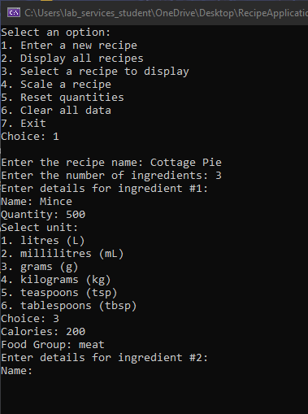

# Recipe Application
## Changes based off on feedBack on Part 1
1. Error Handling for Numeric Inputs: Added error handling for user inputs to ensure valid numeric values are entered for the number of ingredients, quantities, and steps.
2. Validation for Ingredient Names and Steps: Ensured that ingredient names and steps are not empty or whitespace.
3. Validation for Unit Choices: Validated the unit choices to ensure the user enters a number between 1 and 6.
4. Validation for Scaling Factor: Added error handling to ensure the user enters a valid scaling factor (0.5, 2, or 3).

## Introduction
The Recipe Application is a command-line tool designed to help users manage and scale recipes. With this application, you can enter the details of your recipe, including ingredients and steps, scale the recipe up or down, reset quantities to their original values, and clear the data to enter a new recipe.

## Getting Started
To use the Recipe Application, follow these steps:

1.Clone the Repository: Clone the repository containing the Recipe Application source code to your local machine.
  
  git clone https://github.com/your-username/recipe-application.git
  
2.Navigate to the Directory: Change into the directory where you cloned the repository.
  
  cd recipe-application
  
3.Compile the Application: Compile the C# code using a C# compiler such as dotnet.
  
  dotnet build
  
4.Run the Application: Run the compiled application to start using the Recipe Application.
  
  dotnet run

## Usage
Once the Recipe Application is running, you can perform the following actions:

1.Enter Recipe Details: Enter the details of your recipe, including the number of ingredients, their names, quantities, units, and steps.

2.Display all Recipes: Views all the recipes entered in alphabetical order

3.Display specific Recipe: View the full selected recipe, including ingredients and steps, in a neat format.

4.Scale Recipe: Scale the recipe by a factor of 0.5 (half), 2 (double), or 3 (triple). All ingredient quantities will be adjusted accordingly.

5.Reset Quantities: Reset all ingredient quantities to their original values.

6.Clear Data: Clear all entered data to enter a new recipe.

7.Exit: Exit the application.

Follow the on-screen prompts to navigate through the application and perform the desired actions.

